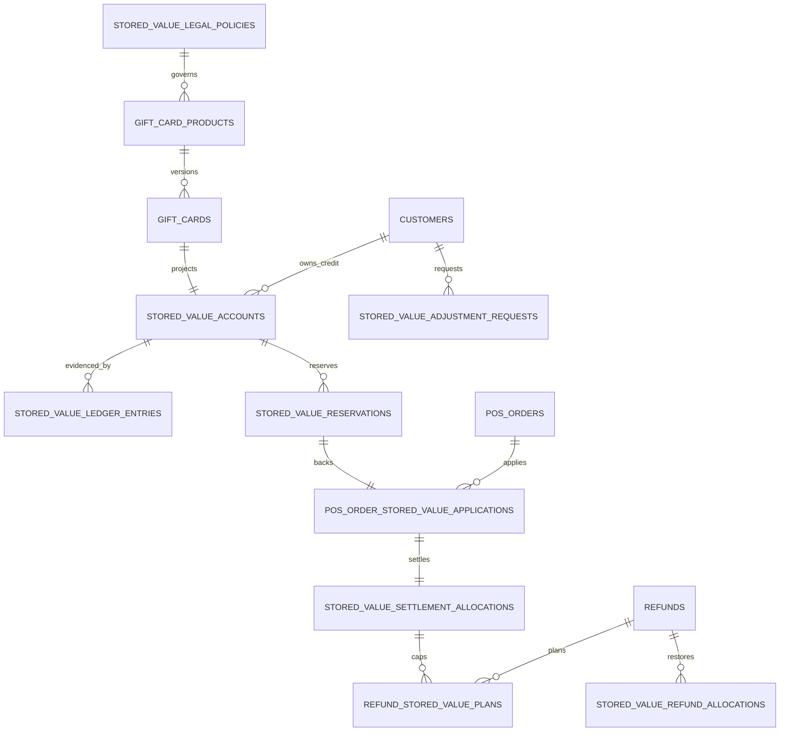

# Sprint 10 ERD

```mermaid
erDiagram
  GIFT_CARD_PRODUCTS ||--o{ GIFT_CARDS : versions
  STORED_VALUE_LEGAL_POLICIES ||--o{ GIFT_CARD_PRODUCTS : governs
  GIFT_CARDS ||--|| STORED_VALUE_ACCOUNTS : projects
  CUSTOMERS ||--o{ STORED_VALUE_ACCOUNTS : owns_credit
  STORED_VALUE_ACCOUNTS ||--o{ STORED_VALUE_LEDGER_ENTRIES : evidenced_by
  STORED_VALUE_ACCOUNTS ||--o{ STORED_VALUE_RESERVATIONS : reserves
  POS_ORDERS ||--o{ POS_ORDER_STORED_VALUE_APPLICATIONS : applies
  STORED_VALUE_RESERVATIONS ||--|| POS_ORDER_STORED_VALUE_APPLICATIONS : backs
  POS_ORDER_STORED_VALUE_APPLICATIONS ||--|| STORED_VALUE_SETTLEMENT_ALLOCATIONS : settles
  REFUNDS ||--o{ REFUND_STORED_VALUE_PLANS : plans
  STORED_VALUE_SETTLEMENT_ALLOCATIONS ||--o{ REFUND_STORED_VALUE_PLANS : caps
  REFUNDS ||--o{ STORED_VALUE_REFUND_ALLOCATIONS : restores
  CUSTOMERS ||--o{ STORED_VALUE_ADJUSTMENT_REQUESTS : requests
```

Every business foreign key is tenant-composite. Ledger and completed allocations are append-only. Card numbers/PINs are never modeled as retrievable plaintext.
