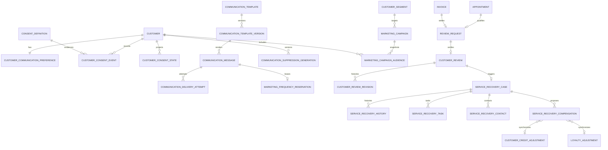

# Sprint 11 ERD

Migration `0022_sprint11_engagement_correctness_hardening` adds leased message claims, consent/preference/suppression snapshots, expiring frequency reservations, campaign terminal counters, delayed review-request policy fields and recovery-compensation synchronization evidence. Every business table carries `tenant_id`; branch-operational records also carry a composite branch foreign key. Ledgers/history are append-only. PostgreSQL is authoritative.
