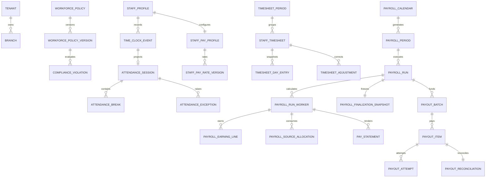

# Sprint 12 ERD

Every operational child carries `tenant_id`; branch/staff foreign keys are composite. Ledger/history tables are append-only. Open-session/open-break, effective-rate overlap and source-use constraints are enforced by PostgreSQL.
