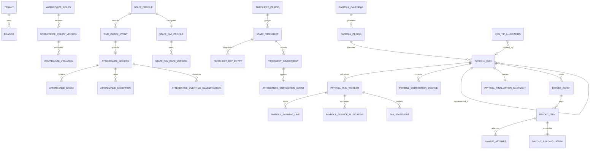

# Sprint 12 ERD

Every operational child carries `tenant_id`; branch/staff foreign keys are composite. Ledger/history tables are append-only. Migration `0025_sprint12_payroll_source_coverage_hardening` adds fail-closed tip dispositions and atomic payroll claims, versioned overtime-classification snapshots, a tenant period no-overlap exclusion constraint, late-attendance exception types and the positive-only supplemental correction constraint. Source payable seconds remain unchanged; every classification row proves `regular + overtime = source payable`.
