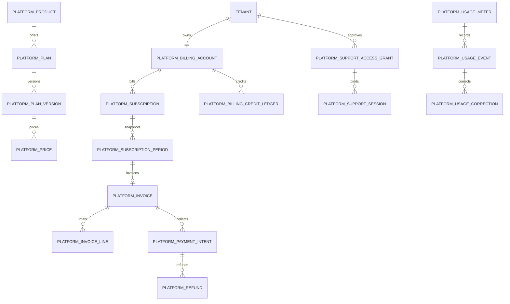

# Sprint 13 ERD

```mermaid
erDiagram
  TENANT ||--|| PLATFORM_BILLING_ACCOUNT : owns
  PLATFORM_PRODUCT ||--o{ PLATFORM_PLAN : offers
  PLATFORM_PLAN ||--o{ PLATFORM_PLAN_VERSION : versions
  PLATFORM_PLAN_VERSION ||--o{ PLATFORM_PRICE : prices
  PLATFORM_BILLING_ACCOUNT ||--o{ PLATFORM_SUBSCRIPTION : bills
  PLATFORM_SUBSCRIPTION ||--o{ PLATFORM_SUBSCRIPTION_PERIOD : snapshots
  PLATFORM_USAGE_METER ||--o{ PLATFORM_USAGE_EVENT : records
  PLATFORM_USAGE_EVENT ||--o{ PLATFORM_USAGE_CORRECTION : corrects
  PLATFORM_SUBSCRIPTION_PERIOD ||--o| PLATFORM_INVOICE : invoices
  PLATFORM_INVOICE ||--o{ PLATFORM_INVOICE_LINE : totals
  PLATFORM_INVOICE ||--o{ PLATFORM_PAYMENT_INTENT : collects
  PLATFORM_PAYMENT_INTENT ||--o{ PLATFORM_REFUND : refunds
  PLATFORM_BILLING_ACCOUNT ||--o{ PLATFORM_BILLING_CREDIT_LEDGER : credits
  TENANT ||--o{ PLATFORM_SUPPORT_ACCESS_GRANT : approves
  PLATFORM_SUPPORT_ACCESS_GRANT ||--o{ PLATFORM_SUPPORT_SESSION : binds
```

SaaS financial tables have no foreign key to salon POS, stored-value, loyalty or payroll ledgers.
