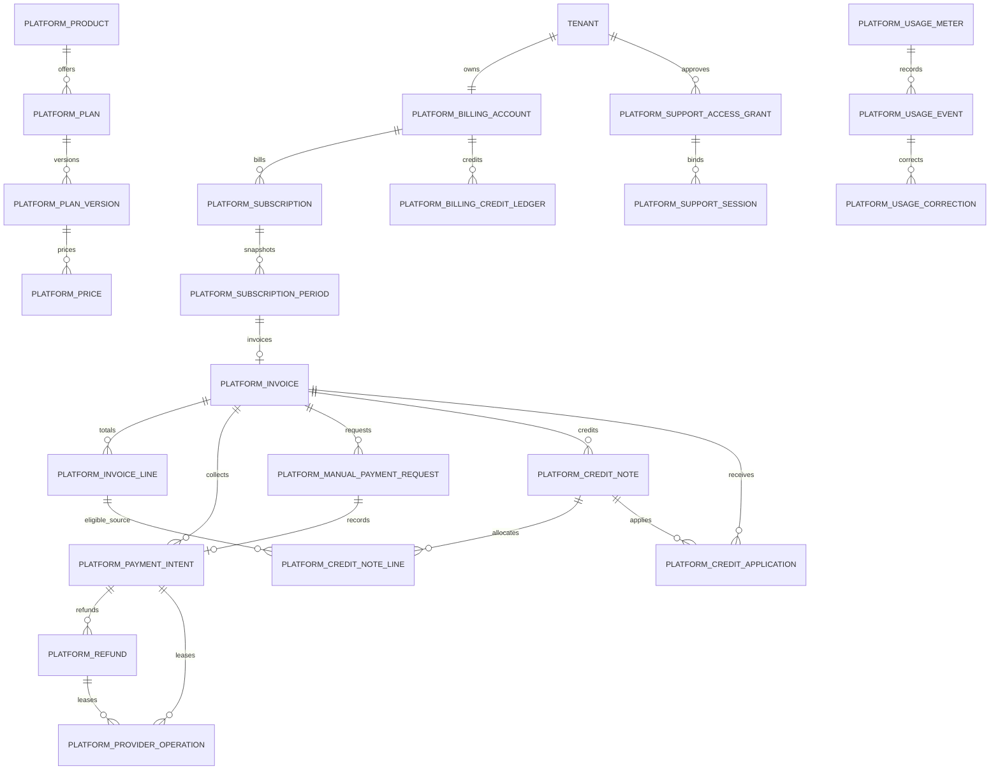

# Sprint 13 ERD

Manual payment, refund, and credit-note histories are append-only. Provider operations use short database leases; network calls occur after the claim transaction commits and before the finish transaction starts. Credit issuance is a positive account-credit ledger entry, while application is a distinct negative entry linked through `platform_credit_applications`.

SaaS financial tables have no foreign key to salon POS, stored-value, loyalty or payroll ledgers.
