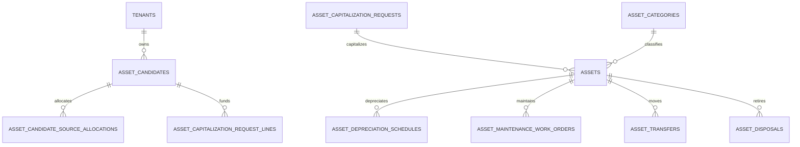

# Sprint 16 ERD

```mermaid
erDiagram
  TENANTS ||--o{ ASSET_CANDIDATES : owns
  ASSET_CANDIDATES ||--o{ ASSET_CANDIDATE_SOURCE_ALLOCATIONS : allocates
  ASSET_CANDIDATES ||--o{ ASSET_CAPITALIZATION_REQUEST_LINES : funds
  ASSET_CAPITALIZATION_REQUESTS ||--o{ ASSETS : capitalizes
  ASSET_CATEGORIES ||--o{ ASSETS : classifies
  ASSETS ||--o{ ASSET_DEPRECIATION_SCHEDULES : depreciates
  ASSETS ||--o{ ASSET_MAINTENANCE_WORK_ORDERS : maintains
  ASSETS ||--o{ ASSET_TRANSFERS : moves
  ASSETS ||--o{ ASSET_DISPOSALS : retires
```
