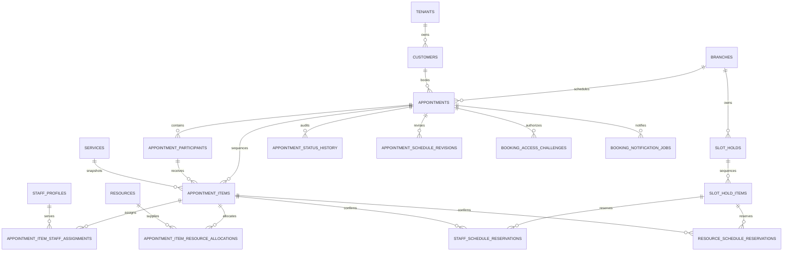

# Sprint 4 booking ERD

Migration `0009_booking_appointment_lifecycle` extends the existing appointment aggregate in place. Every business relation retains `tenant_id`; composite foreign keys and branch checks prevent cross-tenant and cross-branch references.

Staff reservations use a PostgreSQL GiST exclusion constraint for active overlapping ranges. Shared resource capacity is checked while advisory-locking resource IDs in deterministic order. Holds are durable PostgreSQL rows; Redis never owns booking truth.
