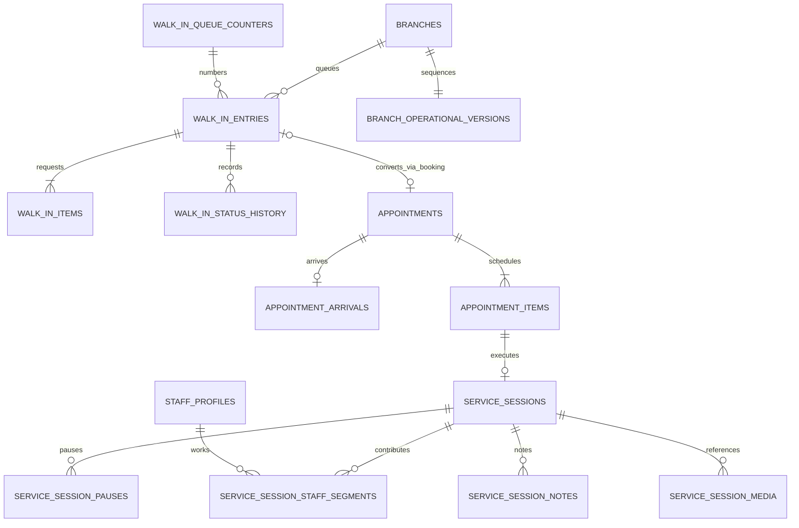

# Sprint 5 operational ERD

Migration `0011_walkin_checkin_service_execution` extends booking without changing migrations 0001-0010. PostgreSQL remains authoritative and every mutable aggregate is tenant-scoped.

Composite foreign keys prevent tenant/branch crossing. Partial unique indexes enforce one arrival, one session per item, one open pause, one open primary per session and one open execution segment per staff. Queue and execution history is append-only; media binary content is never stored in PostgreSQL.
