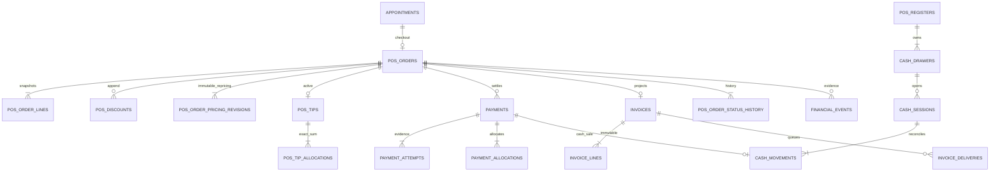

# Sprint 6 ERD

Every business table is tenant scoped; branch/register entities use composite tenant foreign keys. Partial unique indexes protect the one active appointment order and one active drawer session. Pricing revisions preserve the complete authoritative before/after totals and pricing version for every recalculation.
