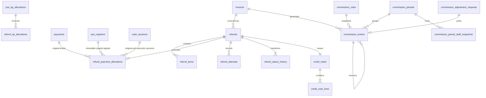

# Sprint 7 ERD — financial corrections and commission

Every relationship is tenant-scoped through composite foreign keys. Original invoice/payment/tip/earning evidence is never updated by refund flows.

Migration `0015_sprint7_financial_correctness_hardening` adds immutable cash attribution, tenant-scoped provider references, `commission_entries.adjustment_request_id`, conditional invoice/adjustment attribution, one-entry-per-adjustment uniqueness and the active commission-rule range exclusion constraint. `staff_net_tip` now includes only allocations belonging to an `ACTIVE` tip version.
