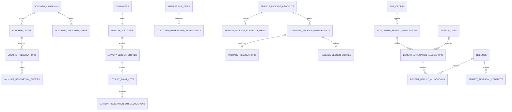

# Sprint 8 ERD

Every business child carries `tenant_id`; cross-aggregate foreign keys are composite tenant keys. Ledger/history and benefit allocation tables reject UPDATE and DELETE. `covered_order_line_id` makes package uniqueness line-specific. PostgreSQL projections are authoritative; Worker jobs and realtime are derived delivery mechanisms.
