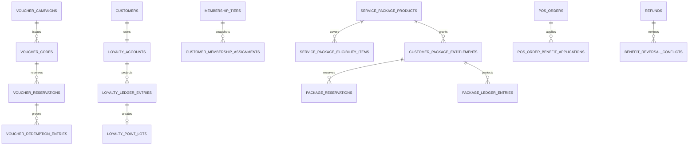

# Sprint 8 ERD

Every business child carries `tenant_id`; cross-aggregate foreign keys are composite tenant keys. Ledger/history tables reject UPDATE and DELETE. PostgreSQL projections are authoritative; Worker jobs and realtime are derived delivery mechanisms.
