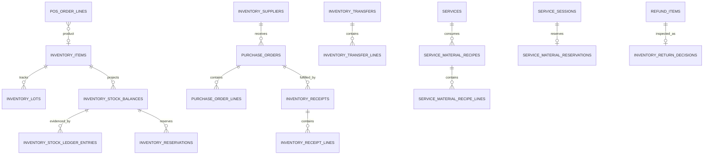

# Sprint 9 ERD

```mermaid
erDiagram
  INVENTORY_ITEMS ||--o{ INVENTORY_LOTS : tracks
  INVENTORY_ITEMS ||--o{ INVENTORY_STOCK_BALANCES : projects
  INVENTORY_STOCK_BALANCES ||--o{ INVENTORY_STOCK_LEDGER_ENTRIES : evidenced_by
  INVENTORY_STOCK_BALANCES ||--o{ INVENTORY_RESERVATIONS : reserves
  INVENTORY_SUPPLIERS ||--o{ PURCHASE_ORDERS : receives
  PURCHASE_ORDERS ||--o{ PURCHASE_ORDER_LINES : contains
  PURCHASE_ORDERS ||--o{ INVENTORY_RECEIPTS : fulfilled_by
  INVENTORY_RECEIPTS ||--o{ INVENTORY_RECEIPT_LINES : contains
  INVENTORY_TRANSFERS ||--o{ INVENTORY_TRANSFER_LINES : contains
  SERVICES ||--o{ SERVICE_MATERIAL_RECIPES : consumes
  SERVICE_MATERIAL_RECIPES ||--o{ SERVICE_MATERIAL_RECIPE_LINES : contains
  SERVICE_SESSIONS ||--o| SERVICE_MATERIAL_RESERVATIONS : reserves
  POS_ORDER_LINES }o--o| INVENTORY_ITEMS : product
  REFUND_ITEMS ||--o| INVENTORY_RETURN_DECISIONS : inspected_as
```
