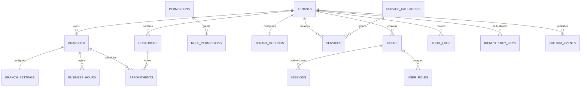

# ERD v1

Sprint 0 establishes shared isolation and reliability tables plus deterministic fixtures. Later sprint migrations extend aggregates without bypassing tenant foreign keys.

All business tables carry `tenant_id`; branch-scoped tables carry `branch_id`. Composite tenant foreign keys prevent accidental cross-tenant references. PostgreSQL is authoritative.

Sprint 1 adds rotating device sessions, permission mappings, tenant/branch settings and effective business hours. Platform support has only a policy boundary; no support-grant or impersonation table is created before the SaaS Administration sprint.
