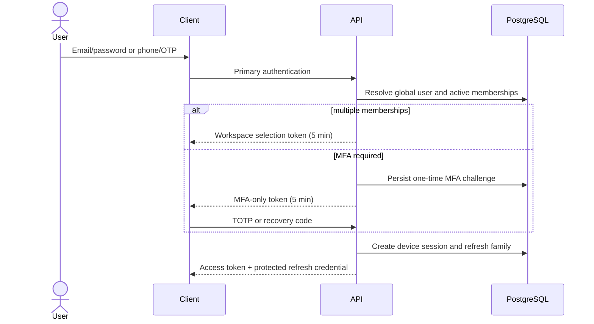

# Sprint 1 identity and authorization flows

## Authentication states

`PRIMARY_AUTHENTICATED` is produced after password or OTP verification. A user with an active required MFA method receives `MFA_REQUIRED`; a required role outside its configured enrollment grace receives `MFA_ENROLLMENT_REQUIRED`. Only a one-purpose, five-minute MFA token is returned in those states. A normal access token and device refresh family are created only after MFA succeeds.

## Invitation

Owner or scoped Manager creates an invitation after role and branch checks. PostgreSQL stores only the token hash; invitation roles and branches use tenant-safe foreign keys. An outbox event queues notification. Acceptance locks and consumes the token, links or creates the global user, activates one tenant membership, assigns role/branch scope, and writes audit/outbox events in one transaction. Resend rotates the token hash; revoke makes it unusable.

## Password recovery

Forgot-password always returns the same accepted response. Reset tokens are hashed, expire after 30 minutes and are consumed once under a row lock. Successful reset enforces the password policy, rotates `security_stamp`, revokes all device sessions, and writes an audit event.

## Phone and OTP

Phone values are canonical E.164. The provider interface isolates delivery from domain logic; development/test uses a controlled fake provider. Challenges live in PostgreSQL, expire after five minutes, allow at most five attempts, enforce a 60-second resend interval and are consumed once. Raw OTP values are neither persisted nor logged.

## Session lifecycle

Web refresh credentials use HttpOnly cookies plus CSRF; mobile refresh credentials use Secure Store. Access tokens remain in memory. Clients coalesce concurrent refreshes into one promise. Server rotation stays strict: the first request creates one successor, reuse revokes the complete family and emits a security event. Role, branch or membership changes increment `authorization_version` and revoke affected sessions.

## Permission matrix

| Role | Organization/branch | Users | Sessions | MFA/audit |
|---|---|---|---|---|
| SALON_OWNER | Full tenant | Invite/update/activate/suspend/assign | Own and tenant | Own manage, user reset, audit read |
| BRANCH_MANAGER | Assigned branches | Lower roles in intersecting branch scope | Own and scoped tenant | Own manage |
| RECEPTIONIST | Read assigned branches | Read only where granted | Own | Own manage |
| CASHIER | Read assigned branches | None | Own | Own manage |
| NAIL_TECHNICIAN | Read assigned branches | None | Own | Own manage |
| ACCOUNTANT | Policy-defined read | None | Own | Own manage |
| MARKETING | Policy-defined read | None | Own | Own manage |
| PLATFORM_SUPER_ADMIN | No salon data by default | No salon data by default | None | Separate platform policy |

Backend guards are authoritative. Cross-tenant lookups and non-intersecting branch targets are denied without returning salon data. The final active Owner cannot be removed.

## Security events and redaction

Catalogued events cover login success/failure, refresh/reuse, rate limiting, invitation lifecycle, password reset, OTP verification, MFA lifecycle, session revocation, authorization denial and tenant-context mismatch. Logs redact password, raw OTP, invitation/reset/MFA tokens, TOTP secrets, recovery codes, bearer tokens and cookies recursively. Automated redaction tests are part of the unit gate.
